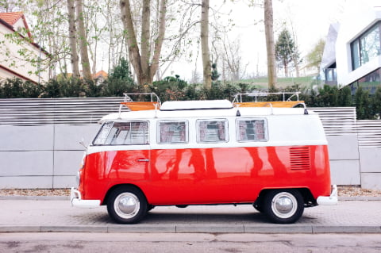

## Mengaudit situs yang perlu dioptimasi dengan Lighthouse
Untuk mencari tahu apa yang bisa kita lakukan untuk mengoptimasi situs kita makan kita perlu melakukan audit terlebih dahulu menggunakan Lighthouse, sebuat perangkat dari Google untuk web developer dapat mengoptimalkan situs yang mereka buat. Cara paling mudah adalah menggunakan Lighthouse yang sudah terintegrasi dengan Chrome Dev Tools.

Untuk melakukan audit dengan Chrome DevTools lakukan langkah berikut:

1. Buka halaman website yang ingin dioptimasi
2. Buka Chrome DevTools
3. Buka panel audit
4. Jalankan audit pada situs yang ingin dioptimasi.

## Memahami Hasil Audit Pada File Gambar
Setelah audit selesai, lihat hasilnya dan cari yang berhubungan dengan file gambar. Biasanya ada 3 rekomendasi yang berhubungan dengan gambar bila kita tidak mengoptimalkan gambar yang digunakan pada situs kita. Rekomendasi tersebut adalah:

## 1. Mengoptimasi gambar agar tidak dimuat bila tidak terlihat di layar


Maksud dari hasil audit ini adalah bila pada saat saat pertama kali halaman dimuat dan ditemukan gambar yang dimuat namun tidak terlihat di layar maka gambar tersebut dianggap tidak perlu dimuat hingga pengguna berinteraksi dengan halaman situs misalnya dengan scrolling atau tapping.

Untuk mengoptimalkannya maka kita perlu melakukan lazy-loading atau hanya memuat pada saat gambar akan terlihat dilayar karena aktifitas pengguna misalnya scrolling halaman.

Lazy loading dengan sudah bisa digunakan mulai dari Chrome 76 tanpa perlu menggunakan library tertentu. Caranya cukup mudah yaitu menambahkan attribute loading pada gambar atau iframe. Sebagai contoh di bawah ini pada tag `` ditambahkan atribut `loading="lazy"`.

```

<iframe src="https://example.com" 
    loading="lazy">
</iframe>
```

Dengan menggunakan atribut `loading="lazy"` pada elemen gambar atau iframe maka secara otomatis file gambar atau iframe tidak akan dimuat bila belum terlihat di layar. Namun bila atribut loading ini belum didukung oleh browser pengguna maka kita perlu melakukan cara berbeda. 

Cara lainnya adalah dengan menyimpan URL file gambar tersebut pada atribut sementara, bukan pada atribut `src` sehingga browser tidak memuat gambar tersebut. Pada saat halaman dimuat, kita akan melakukan pengecekan apakah gambar terlihat di dalam layar atau tidak. Bila terlihat makan kita akan mengubah atribut sementara tersebut menjadi atribut `src`.

```

```

Contoh di atas browser tidak akan memuat gambar karena URL gambar tidak berada pada atribut `src`. Bila terlihat elemen gambar kita ubah menjadi

```

```

Untuk mengubah atribut tersebut kita harus memeriksa apakah elemen gambar akan muncul di layar pada saat pengguna berinteraksi dengan halaman.

### Mengoptimasi gambar pada carousel atau slide show

Melakukan optimasi gambar pada carousel yang berada di dalam layar namun tidak menampilkan semua gambar agak berbeda dengan file gambar yang berada diluar layar. Karena secara teknis gambar yang terlihat hanyak beberapa saja, dan sisanya disembunyikan oleh carousel. Biasanya untuk menampilkannya diperlukan interaksi mengeser gambar bila caraousel tidak diatur untuk berjalan otomatis. 

Untuk carousel ini kita bisa menggunakan Intersection Observer API di mana kita bisa mengukur seberapa jauh sebuah element akan akan masuk di dalam container element pada saat di-scrolling baik vertical ataupun horizontal. 

```
const options = {
  root: document.querySelector('#container'),
  rootMargin: '50px',
  threshold: 0
}

let observer = new IntersectionObserver(callback, options);
```

Gambar di atas menunjukkan bagaimana browser memanggil fungsi callback pada Intersection Observer API. Pada dasarnya bila elemen masuk dalam area cakupan root container ditambah area root margin maka elemen akan diperhitungkan apakah callback perlu dipanggil atau tidak berdasarkan nilai threshold pada options. Threshold 0 berarti 1 pixel pun yang masuk sudah akan memanggil callback, sedangkan nilai 1.0 berarti callback baru dipanggil bila 100% elemen masuk dalam area aktif.

## 2. Mengoptimasi gambar agar memuat file gambar sesuai dengan ukuran layar


Salah satu hal paling sering terjadi adalah editor konten menggunakan gambar yang ukurannya lebih besar dari ukuran layar. Hal ini terjadi karena pada saat pengerjaan konten, editor melakukannya di desktop namun pengguna mengaksesnya melalui mobile.

Untuk mengatasi hal ini sebenarnya pada elemen gambar sudah tersedia atribut srcset yang bisa digunakan untuk mendefenisikan file gambar dengan lebih dari satu ukuran. Browser akan secara otomatis menggunakan gambar. Contohnya sebagai berikut



Gambar di atas adalah gambar yang responsive, dalam artian akan memuat ukuran gambar yang sesuai dengan ukuran layar. Silakan gunakan Chrome DevTools dengan network panel untuk melihat file gambar yang dimuat. Jadi kode HTML gambar standar perlu dioptimalmkan seperti berikut:

Sebelum

```

```

Sesudah

```

```

Pada contoh tersebut pada saat layar terdeteksi berukuran kurang sama dengan 480 pixel maka gambar yang akan dimuat adalah `car-small.jpg` sedangkan pada saat layar kurang sama dengan 1080 pixel maka yang dimuat adalah `car-large.jpg`. Lebih besar dari itu karena tidak didefinisikan pada atribut `srcset` maka agak menggunakan `car-large.jpg` sesuai definisi pada atribut `src`.

## 3. Menggunakan format gambar yang lebih modern


Format gambar juga terus bertransformasi dan dukungan format juga makin luas. Sebagai contoh, dengan format standar JPEG kita bisa melihat bagaimana sebuah gambar berukuran besar dimuat layaknya sebuah layar diturunkan dan secara perspektif pengguna ini terasa lagging. Format baru JPEG progressive memungkinkan hal ini dihindari dan proses memuat gambar lebih terasa baik dengan menampilkan gambar yang blur terlebih dahulu dan perlahan-lahan menjadi lebih jelas.

[Blogpost dari Cloudinary ini](https://cloudinary.com/blog/progressive_jpegs_and_green_martians) memberikan gambaran lebih jelas perbedaan antara format JPG biasa dan progressive.
<video controls="controls" poster="https://cloudinary-res.cloudinary.com/video/upload/progressive_jpeg_scanscripts.jpg" preload="none" style="margin: 0 auto;display: block" width="100%"><source src="https://cloudinary-res.cloudinary.com/video/upload/progressive_jpeg_scanscripts.webm" type="video/webm"><source src="https://cloudinary-res.cloudinary.com/video/upload/progressive_jpeg_scanscripts.mp4" type="video/mp4"><source src="https://cloudinary-res.cloudinary.com/video/upload/progressive_jpeg_scanscripts.ogv" type="video/ogg"></video>

### Memastikan gambar terkompresi optimal
Selain pemilihan format, terkadang kita juga tidak mengoptimalkan kompresi file gambar. Pada saat gambar dibuat dan diekspor dari aplikasi editor gambar, pengaturan kompresi dan format tidak terlalu diperhatikan. Dampaknya terkadang gambar walaupun ukuran sudah sesuai namun ukurannya masih terlalu besar. 

Sebagai contoh dua file berikut adalah gambar yang menggunakan export default dari Photoshop dan gambar yang sudah dioptimalkan dengan MozJPEG melalui <a href="https://squoosh.app" rel="noopener" target="_blank">Squoosh.app</a>.


Bisa terlihat bahwa ukuran file jauh lebih kecil setelah dioptimalkan dengna kualitas yang tidak terlalu terlihat (setidaknya bagi mata saya).

Namun untuk memastikan kita menggunakan ukuran yang optimal bagi browser, kita perlu menggunakan tag [`<picture>`](https://developer.mozilla.org/en-US/docs/Web/HTML/Element/picture) pada html untuk mendefenisikan file gambar dengan format yang berbeda. Contohnya:

```
<picture>
   <source srcset="photo.webp" type="image/webp">
   <source srcset="photo.jxr" type="image/vnd.ms-photo">
   <source srcset="photo.jp2" type="image/jp2">
   
</picture>
```

Atau bila dikombinasikan dengan atribut `srcset` maka kodenya bisa seperti

```
<picture>
    <source srcset="/media/examples/surfer-240-200.webp"
            media="(min-width: 800px)">
    <source srcset="/media/examples/surfer-240-200.jpg"
            media="(min-width: 800px)">
    
</picture>
```

 Kode di atas akan membantu browser untuk memuat file yang sesuai urutan yang ditentukan dan akan memuat file berikutnya bila file sebelumnya tidak didukung oleh browser. Sebagai contoh, format WEBP belum didukung oleh Safari, maka Safari akan memuat file JPG sebagai penggantinya.


## Referensi
1. https://developers.google.com/web/fundamentals/performance/lazy-loading-guidance/images-and-video/
2. https://images.guide/
3. https://web.dev/native-lazy-loading


