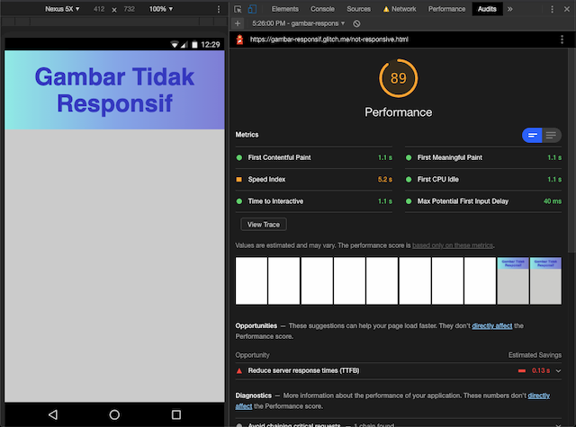
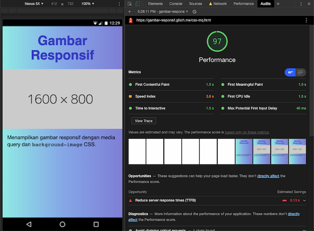
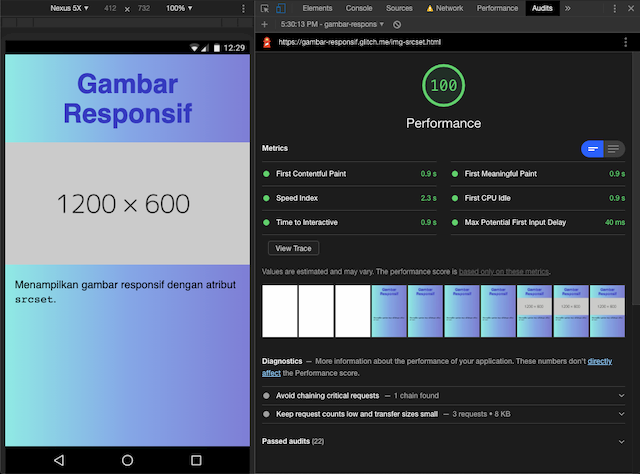

_Artikel ini membahas teknik-teknik memuat dan menampilkan gambar responsif yang sesuai dengan ukuran viewport._

**Daftar Isi**

- [Non-responsif](#non-responsif)
- [Teknik 0: CSS `width` dan `height`](#teknik-0-css-width-dan-height)
- [Teknik 1: CSS media query dan `background-image`](#teknik-1-css-media-query-dan-background-image)
  - [File mana yang di-download?](#file-mana-yang-di-download)
  - [Media query untuk layar dengan kepadatan pixel tinggi (“retina”)](#media-query-untuk-layar-dengan-kepadatan-pixel-tinggi-retina)
  - [Gabungan media query `width` dan `resolution`](#gabungan-media-query-width-dan-resolution)
  - [Uji coba CSS background-image dengan media query](#uji-coba-css-background-image-dengan-media-query)
- [Teknik 2: `img` dengan atribut `srcset`](#teknik-2-img-dengan-atribut-srcset)
  - [Uji coba img srcset](#uji-coba-img-srcset)
- [Perbandingan performa](#perbandingan-performa)
- [Penutup](#penutup)
  - [Extra credits](#extra-credits)
- [Referensi](#referensi)

---

Perangkat (_device_) yang digunakan untuk mengakses web makin bervariasi—makin besar, makin kecil, makin tajam. Walaupun tag `img` sudah ada sejak tahun 1993, baru beberapa tahun terakhir memilih ukuran file gambar yang tepat jadi dilema.

Jika gambar terlalu kecil, terlihat pecah (_pixelated_) di layar yang lebih besar. Seringkali gambar berukuran besar jadi pilihan. Akibatnya user harus men-download file yang lebih besar dari yang dibutuhkan. Padahal hal ini dapat mengganggu performa dan pengalaman pengguna (UX), karena:

- Proses loading jadi lebih lambat.
- Browser harus bekerja lebih keras untuk mengecilkan file gambar, misalnya dari 2000px menjadi 375px.
- Menguras kuota user yang menggunakan paket data.

Muncullah kebutuhan atas **gambar responsif**, yaitu kemampuan untuk _memuat file gambar yang ukurannya sesuai dengan layar perangkat user_.

Ada beberapa teknik gambar responsif yang banyak digunakan. Yang lebih dulu populer adalah media query dan `background-image` CSS. Lalu hadirlah atribut `srcset` untuk tag `img` yang memang berfungsi untuk menampilkan gambar secara responsif.

Artikel ini akan membahas _bagaimana penggunaan_ dan _apa saja perbedaan_ kedua teknik tersebut. Kita akan membuat halaman dengan spesifikasi sebagai berikut:

- Berisi satu gambar yang memenuhi lebar layar (100%)
- Rasio/proporsi gambar 2:1
- Ada 6 ukuran file gambar: 400 x 200px, 800 x 400px, 1200 x 600px, 1600 x 800px, 2000 x 1000px, dan 2400 x 1200px

Di dunia nyata, breakpoint dan ukuran yang digunakan tentu berbeda. Fokus di contoh ini adalah untuk mendemonstrasikan cara kerja masing-masing teknik. Ada dua tujuan gambar responsif yang harus dicapai:

1. File gambar yang dimuat adalah yang _paling mendekati_ ukuran dan kepadatan pixel layar
2. File gambar berukuran _sama atau lebih besar_ dari ukuran layar (agar tidak pecah)

💻 Kamu bisa melihat dan mencoba kode demo di [halaman Glitch ini](https://glitch.com/~gambar-responsif).

## Non-responsif

```html

```

Gambar ini sama sekali belum menggunakan teknik responsif. [Lihat demo](https://gambar-responsif.glitch.me/not-responsive.html).



Selain belum mencapai kedua tujuan di atas, jika diakses dari layar berukuran kecil, gambar yang terlalu besar merusak (_stretch_) layout halaman dan sulit dilihat isinya.

## Teknik 0: CSS `width` dan `height`

```html


<style>
  img {
    width: 100%;
    height: auto; /* tentukan tinggi gambar secara otomatis sesuai isi file */
  }
</style>
```

Teknik ini menampilkan gambar responsif _dari segi visual_ (menyesuaikan lebar layar), tapi belum memuat gambar secara responsif. Berapapun lebar viewport, file yang di-download berukuran 1600 x 800px. [Lihat demo](https://gambar-responsif.glitch.me/img-css-width.html).



UI library (Bootstrap, Bulma, dsb) atau style reset biasanya sudah memiliki global rule `img { max-width: 100% }` untuk menjawab masalah ini.

Agar lebih optimal, definisikan `height` secara eksplisit jika memungkinkan. Misalnya, jika rasio 2:1 dan lebar gambar = 100% lebar layar, maka tinggi gambar adalah separuh (50%) lebar layar. [Lihat demo](https://gambar-responsif.glitch.me/img-css-width-height.html).

```html


<style>
  img {
    width: 100%;
    height: 50vw; /* 50% lebar layar */
  }
</style>
```

Selama file gambar dalam proses _loading_, browser belum mendapat isi gambar dan value `height: auto` masih `0`. Saat file gambar selesai di-download, barulah value `height` diperbarui. Teks di bawah gambar pun terdorong turun.



Pergeseran layout (_layout shift_) seperti ini perlu diminimalisir karena mengganggu pengalaman pengguna. Kita bisa memantaunya menggunakan metric [Cumulative Layout Shift](https://web.dev/cls/) yang merupakan bagian dari Core Web Vitals.

Dengan menentukan `height` secara eksplisit, kita bisa meminimalisir _layout shift_. Sebaiknya kita juga mengisi atribut `width` dan `height` tag `img` sebagai _fallback_ jika style CSS tertunda atau gagal dimuat.



Meski belum memenuhi kebutuhan gambar responsif, `width` dan `height` CSS perlu digunakan untuk tampilan layout yang lebih stabil. Kita dapat menganggapnya sebagai “Teknik 0” gambar responsif.

Nah, sekarang kita akan lanjut ke teknik gambar responsif pertama.

## Teknik 1: CSS media query dan `background-image`

[Media query CSS](https://developer.mozilla.org/id/docs/Web/Guide/CSS/Media_queries) adalah fitur yang krusial untuk [desain web responsif](https://web.dev/responsive-web-design-basics/#size-content). Kita bisa menentukan kondisi berdasarkan spesifikasi atau fitur perangkat yang digunakan (jenis media, lebar layar, kepadatan pixel, dll). Style dalam media query hanya dijalankan jika syarat terpenuhi.

Kita bisa menggunakan properti `background-image` dalam media query untuk memuat gambar berdasarkan kondisi lebar viewport. [Lihat demo versi dasar](http://gambar-responsif.glitch.me/css-mq-basic.html).

```html
<div class="responsive-img" aria-hidden="true"></div>

<style>
  .responsive-img {
    /* Wajib tentukan dimensi elemen container */
    width: 100%;
    height: 50vw;
    /* Pastikan gambar mengisi elemen container dengan benar */
    background-size: cover;
    background-repeat: no-repeat;
    /* Fallback/initial image */
    background-image: url("small.png");
  }

  /* Contoh dasar background-image dalam media query */
  @media screen and (min-width: 992px) {
    .responsive-img {
      background-image: url("large.png");
    }
  }
</style>
```

- Gunakan elemen `div`, bukan `img`. Atribut `aria-hidden` berfungsi untuk aksesibilitas agar teknologi pembaca layar (_screen reader_) melewati `div` kosong ini. Jika terpaksa menggunakan _background image_ untuk konten yang memiliki makna, gunakan role/atribut ARIA yang sesuai, misalnya `<div class="responsive-img" role="img" aria-label="Deskripsi gambar">`.
- Tambahkan style CSS untuk mengatur ukuran dan tampilan background.
- Tentukan file gambar default/fallback berukuran kecil, `small.png`.
- Jika lebar viewport 992px atau lebih, gunakan file yang lebih besar, `large.png`.

### File mana yang di-download?

Kalau kita lihat lagi contoh di atas, jika viewport >= 992px, _kedua baris_ style `background-image` akan terbaca. Yang pertama (`small`) sebagai style default, kedua (`large`) karena memenuhi kondisi media query. Sesuai cara kerja CSS, yang diterapkan adalah style terakhir (`large`).

Lalu, apakah browser men-download kedua file? Jawabannya: Masing-masing browser punya perilaku berbeda. Sebagian besar browser modern cukup “pintar” untuk hanya men-download file yang akan ditampilkan.



Studi kasus yang rinci bisa dilihat di [artikel oleh Tim Kadlec ini](https://timkadlec.com/2012/04/media-query-asset-downloading-results/), khususnya test 4 dan test 7. Saat ini dukungan browser sudah lebih baik sejak artikel tersebut ditulis tahun 2012. Agar lebih _foolproof_, kita bisa gunakan kombinasi `max-width` dan `min-width`, dan hilangkan style `background-image` default di luar media query.

### Media query untuk layar dengan kepadatan pixel tinggi (“retina”)

Makin banyak device yang memiliki layar dengan kepadatan pixel (_pixel density_) tinggi. Apple pertama kali mempopulerkan fitur ini (iPhone 4, 2010) dengan istilah “Retina display”. Istilah “retina” pun kerap digunakan untuk menyebut device apapun yang kepadatan pixelnya tinggi.

_Device pixel ratio_ adalah perbandingan antara 1 pixel fisik (_device / physical pixel_) dan 1 pixel CSS. Contohnya, iPhone 3G dan 4 memiliki ukuran fisik layar yang sama, tapi kepadatan pixel iPhone 4 dua kali lipat iPhone 3G.

|                      | iPhone 3G                                            | iPhone 4 (Retina)                                   |
| -------------------- | ---------------------------------------------------- | --------------------------------------------------- |
| Spesifikasi          | [Wikipedia](https://en.wikipedia.org/wiki/IPhone_3G) | [Wikipedia](https://en.wikipedia.org/wiki/IPhone_4) |
| Kepadatan            | 163 ppi                                              | 326 ppi                                             |
| Resolusi pixel       | 320x480 pixel                                        | 640x960 pixel                                       |
| _Device pixel ratio_ | `1` (1 pixel device = 1 pixel CSS)                   | `2` (2 pixel device = 1 pixel CSS)                  |

Device pixel ratio tidak hanya `1` dan `2`, namun ada juga `1.5`, `3`, dan mungkin akan bertambah di masa mendatang.

Ukuran gambar perlu disesuaikan dengan _device pixel ratio_ agar terlihat tajam. Misalnya, walaupun layar iPhone 4 memiliki lebar 320px dalam pixel CSS, ukuran gambar yang ideal adalah 640px sesuai lebar pixel device/fisik. Untuk menentukan query berdasarkan _device pixel ratio_, gunakan ekspresi `resolution` (`min-resolution`, `max-resolution`) dengan unit `dppx`.

Catatan:

- `-webkit-device-pixel-ratio` adalah [query non-standar](https://developer.mozilla.org/en-US/docs/Web/CSS/@media/-webkit-device-pixel-ratio) yang kegunaannya mirip dengan `resolution`. Misalnya, `min-resolution: 2dppx` sama dengan `-webkit-min-device-pixel-ratio: 2`. Saat ini, browser major yang hanya mendukung `-webkit-device-pixel-ratio` adalah Safari macOS maupun iOS.
- Jika perlu presisi lebih, kita bisa menggunakan unit `dpi`, misalnya `min-resolution: 326dpi`.

### Gabungan media query `width` dan `resolution`

```html
<div class="responsive-img" aria-hidden="true"></div>

<style>
  .responsive-img {
    width: 100%;
    height: 50vw;
    background-size: cover;
    background-repeat: no-repeat;
    background-image: url("https://dummyimage.com/400x200");
  }

  /* device pixel ratio < 2 */

  @media screen and (min-width: 401px) and (max-width: 800px) {
    .responsive-img {
      background-image: url("https://dummyimage.com/800x400");
    }
  }
  @media screen and (min-width: 801px) and (max-width: 1200px) {
    .responsive-img {
      background-image: url("https://dummyimage.com/1200x600");
    }
  }
  @media screen and (min-width: 1201px) and (max-width: 1600px) {
    .responsive-img {
      background-image: url("https://dummyimage.com/1600x800");
    }
  }
  @media screen and (min-width: 1601px) and (max-width: 2000px) {
    .responsive-img {
      background-image: url("https://dummyimage.com/2000x1000");
    }
  }
  @media screen and (min-width: 2001px) {
    .responsive-img {
      background-image: url("https://dummyimage.com/2400x1200");
    }
  }

  /* device pixel ratio >= 2 */

  @media screen and (min-resolution: 2dppx),
    screen and (-webkit-min-device-pixel-ratio: 2) {
    .responsive-img {
      background-image: url("https://dummyimage.com/800x400");
    }
  }
  @media screen and (min-width: 401px) and (max-width: 800px) and (min-resolution: 2dppx),
    screen and (min-width: 401px) and (max-width: 800px) and (-webkit-min-device-pixel-ratio: 2) {
    .responsive-img {
      background-image: url("https://dummyimage.com/1600x800");
    }
  }
  @media screen and (min-width: 801px) and (min-resolution: 2dppx),
    screen and (min-width: 801px) and (-webkit-min-device-pixel-ratio: 2) {
    .responsive-img {
      background-image: url("https://dummyimage.com/2400x1200");
    }
  }
</style>
```

- Kode di atas menggunakan kombinasi `min-width` dan `max-width` untuk memperjelas range lebar viewport dan gambar yang digunakan. (**Contoh:** Jika lebar viewport antara 401px - 800px, gunakan gambar yang lebarnya 800px.)
- Query `min-resolution` di contoh ini hanya mendeteksi _device pixel ratio_ kurang dari `2`, ATAU `2` dan lebih. Rasio `1.5` mendapat file gambar yang sama dengan rasio `1`. Sebaliknya, rasio `2.5` ke atas tetap mendapat gambar dua kali ukuran viewport.

### Uji coba CSS background-image dengan media query

Hasil uji coba untuk [halaman demo](https://gambar-responsif.glitch.me/css-mq.html).

| Jenis device               | Browser                                             | Lebar pixel CSS | Lebar pixel device | DPR | Lebar file gambar |
| -------------------------- | --------------------------------------------------- | --------------- | ------------------ | --- | ----------------- |
| Macbook Air                | Chrome 81; Firefox 76; Safari macOS 12 / iOS 11 \*️⃣ | 360             | 360                | 1   | ✅ 400            |
| Macbook Air                | Chrome 81; Firefox 76; Safari macOS 12              | 1440            | 1440               | 1   | ✅ 1600           |
| iPhone 8 \*️⃣               | Safari iOS 11                                       | 375             | 750                | 2   | ✅ 800            |
| iPhone 8 \*️⃣\*️⃣            | Chrome 81                                           | 375             | 750                | 2   | ✅ 800            |
| Xiaomi Redmi 4A            | Chrome Canary 82; Chrome 77 (Android 6)             | 360             | 720                | 2   | ✅ 800            |
| Xiaomi Redmi 4A            | Chrome Canary 82; Chrome 77 (Android 6)             | 640             | 1280               | 2   | ✅ 1600           |
| iPad mini 2                | Safari iOS                                          | 768             | 1536               | 2   | ✅ 1600           |
| iPad mini 2                | Safari iOS                                          | 1024            | 2048               | 2   | ✅ 2400           |
| Samsung Galaxy Note \*️⃣\*️⃣ | Chrome 81                                           | 360             | 1080               | 3   | 🌀 800            |

- \*️⃣ Simulasi user agent iOS 11 di Safari Responsive Design Mode
- \*️⃣\*️⃣ Simulasi dengan Chrome DevTools
- 🌀 Gambar yang dimuat tidak sesuai DPR karena media query-nya tidak ditulis pada contoh ini. Cukup tambahkan media query yang sesuai jika perlu.

## Teknik 2: `img` dengan atribut `srcset`

```html

```

Kita menggunakan tag `img` seperti biasa dengan tambahan atribut `srcset`. Atribut ini berisi string _sumber file_ dan _lebar file_ yang dipisahkan tanda koma. _Sumber file_ adalah path ke file gambar (sama seperti isi atribut `src`), dan _lebar file_ adalah integer dengan satuan `w`.

Dalam bahasa manusia, _“Hai browser, saya punya file-file gambar ini. Tolong pilih yang paling sesuai, ya.”_

- `https://dummyimage.com/400x200 400w`
  - File `https://dummyimage.com/400x200` lebarnya 400px
- `https://dummyimage.com/800x400 800w`
  - File `https://dummyimage.com/800x400` lebarnya 800px (dan seterusnya)

Kenapa perlu mencantumkan lebar? Agar browser bisa tahu lebar file tanpa harus men-download semua file. Browser akan memilih ukuran file yang paling mendekati lebar dan resolusi layar berdasarkan data yang kita sediakan. Contoh:

- Jika halaman di bawah diakses dari laptop ber-DPR 1 dengan jendela browser di-resize seukuran 375px, gambar yang dimuat adalah gambar `400x200`
- Jika diakses dari iPhone 6 (DPR 2), yang dimuat `800x400`
- Jika diakses dari Galaxy Note 3 (DPR 3), yang dimuat `1200x600`
- Jika diakses dari browser yang belum mendukung `srcset`, isi atribut `src` digunakan seperti biasa



### Uji coba img srcset

Hasil uji coba untuk [halaman demo](https://gambar-responsif.glitch.me/img-srcset.html).

| Jenis device               | Browser                                             | Lebar pixel CSS | Lebar pixel device | DPR | Lebar file gambar |
| -------------------------- | --------------------------------------------------- | --------------- | ------------------ | --- | ----------------- |
| Macbook Air                | Chrome 81; Firefox 76; Safari macOS 12 / iOS 11 \*️⃣ | 360             | 360                | 1   | ✅ 400            |
| Macbook Air                | Chrome 81; Firefox 76; Safari macOS 12              | 1440            | 1440               | 1   | ✅ 1600           |
| iPhone 8 \*️⃣               | Safari iOS 11                                       | 375             | 750                | 2   | ✅ 800            |
| iPhone 8 \*️⃣\*️⃣            | Chrome 81                                           | 375             | 750                | 2   | ✅ 800            |
| Xiaomi Redmi 4A            | Chrome Canary 82; Chrome 77 (Android 6)             | 360             | 720                | 2   | ✅ 800            |
| Xiaomi Redmi 4A            | Chrome Canary 82; Chrome 77 (Android 6)             | 640             | 1280               | 2   | ❓ 1200           |
| iPad mini 2                | Safari iOS                                          | 768             | 1536               | 2   | ✅ 1600           |
| iPad mini 2                | Safari iOS                                          | 1024            | 2048               | 2   | ✅ 2400           |
| Samsung Galaxy Note \*️⃣\*️⃣ | Chrome 81                                           | 360             | 1080               | 3   | ✅ 1200           |

- \*️⃣ Simulasi user agent iOS 11 di Safari Responsive Design Mode
- \*️⃣\*️⃣ Simulasi dengan Chrome DevTools
- ❓ Di layar berukuran lebar 1280px (pixel device) / 640px (pixel CSS), ekspektasi gambar yang dimuat adalah **1600px**. Tapi di browser Chrome (Chrome 81 macOS, Chrome Canary 82 Android, Chrome 77 Android), yang dimuat adalah **1200px**.
  - Perilaku ini tidak terjadi di Safari (macOS dan simulasi user agent iOS 11).
  - Perilaku ini tidak terjadi di Chrome jika DPR 1 (jika pixel device sama dengan pixel CSS).

## Perbandingan performa

Kita akan mengukur performa tiga versi halaman dengan pengaturan berikut:

- Chrome 81 MacOS incognito mode
- DevTools setting: Disable cache, throttle koneksi Fast 3G
- Setting **Lighthouse Audit**: kategori _Performance_, device _Mobile_
- Setting **Performance**: DPR 2, lebar viewport 375px (CSS pixel) / 750px (device pixel)
- Pengukuran tab Performance dijalankan dua kali, hasilnya dipisahkan tanda koma

|                    | Tidak responsif                                               | CSS media query                                       | img srcset                                                |
| ------------------ | ------------------------------------------------------------- | ----------------------------------------------------- | --------------------------------------------------------- |
|                    | [Demo](http://gambar-responsif.glitch.me/not-responsive.html) | [Demo](http://gambar-responsif.glitch.me/css-mq.html) | [Demo](http://gambar-responsif.glitch.me/img-srcset.html) |
| **🗂 Lighthouse**   |                                                               |                                                       |                                                           |
| Performance Score  | 89                                                            | 97                                                    | 100                                                       |
| Speed Index        | 5.2 s                                                         | 3.6 s                                                 | 2.3 s                                                     |
| FCP, TTI, FMP, FCI | 1.1 s                                                         | 1.5 s                                                 | 0.9 s                                                     |
| **🗂 Network**      |                                                               |                                                       |                                                           |
| Image file size    | 9.4 kb (2400x1200)                                            | 2.9 kb (800x400)                                      | 2.9 kb (800x400)                                          |
| Image load time    | 5.08 s, 2.27 s                                                | 578 ms, 814 ms                                        | 1.66 s, 1.59 s                                            |
| Transferred        | 11.3 kB                                                       | 6.8 kB                                                | 5.2 kB                                                    |
| Resources          | 10.5 kB                                                       | 6.1 kB                                                | 4.5 kB                                                    |
| Finish             | 5.68 s, 4.93 s                                                | 2.95 s, 2.85 s                                        | 2.26 s, 2.20 s                                            |
| Load               | 5.68 s, 4.93 s                                                | 2.96 s, 2.86 s                                        | 2.27 s, 2.20 s                                            |







Dari hasil di atas, dapat kita lihat bahwa kecepatan dan performa dapat berubah-ubah dan tidak hanya ditentukan oleh isi gambar saja. Tapi, mengoptimasi gambar—dalam hal ini dengan cara memuat gambar responsif—dapat membantu meningkatkan performa. Isi payload jadi lebih ringan, waktu loading jadi lebih cepat.

## Penutup

Berikut ini ringkasan dari teknik-teknik yang sudah kita coba.

- **CSS width dan height** belum bisa memuat file gambar secara responsif. Tapi perlu diterapkan untuk tampilan visual yang responsif dan stabil.

- Baik **media query CSS** maupun `img` dengan **atribut `srcset`** dapat digunakan untuk memuat gambar secara responsif. Dengan teknik-teknik ini, kita dapat menyajikan file gambar dengan lebih cepat, hemat, dan enak dilihat di layar pengguna, apapun perangkat yang digunakan.

- Kedua teknik dapat diterapkan secara aksesibel.

  - Gunakan `img alt="Deskripsi gambar"` agar pembaca layar membacakan deskripsi gambar; atau `img alt=""` agar pembaca layar melewatinya.
  - Gunakan `div role="img" aria-label="Deskripsi gambar"` agar pembaca layar menganggap elemen `div` sebagai gambar dan membacakan deskripsinya; atau `div aria-hidden="true"` agar pembaca layar melewatinya.

- Kedua teknik memiliki keunggulan dan kekurangan masing-masing.

  - Media query CSS sangat fleksibel karena kita mendefinisikan seluruh kondisi media query (lebar viewport, _device pixel ratio_, dsb) secara manual. Namun, karena seluruh kondisi harus didefinisikan satu persatu, kode cenderung lebih panjang dan sangat sulit untuk meng-cover semua kombinasi lebar dan kepadatan pixel.
  - Hanya media query CSS yang dapat men-download gambar _khusus untuk breakpoint tertentu_ dengan query `max-width` dan `min-width`.
  - Sebaliknya, dengan `srcset`, pemilihan file gambar berdasarkan lebar viewport dan _device pixel ratio_ dilakukan secara otomatis oleh browser 🤯. Kode lebih ringkas; menggunakan gambar responsif jadi lebih mudah. Konsekuensinya, kita bergantung pada browser untuk pemilihan gambar dengan kemungkinan _quirks_ atau perilaku yang inkonsisten.

- Kedua teknik ini juga memiliki peruntukan masing-masing.
  - `background-image` CSS sebaiknya digunakan untuk gambar dekoratif yang bukan bagian dari _page content_ (isi utama halaman).
  - Tag `img` digunakan untuk gambar yang berperan sebagai _page content_, yang perlu ditampilkan walaupun CSS tidak termuat, dimatikan, atau dimodifikasi (contoh: “Reader Mode” Safari iOS, aplikasi _reader_ seperti Pocket, atau saat dicetak).

### Extra credits

Beberapa teknik dan strategi yang belum dibahas di artikel ini, yang dapat dieksplorasi lebih lanjut.

- `sizes` — Dengan `srcset`, browser mengasumsikan suatu gambar selalu ditampilkan full screen/sesuai lebar layar (100%). Tambahkan atribut `sizes` untuk mengatur lebar gambar pada ukuran-ukuran viewport tertentu. Misalnya, suatu gambar ditampilkan full screen (100%) di layar kecil, 50% di layar besar. Dengan `sizes` , browser bisa memilih gambar paling sesuai dengan memperhitungkan spesifikasi ukuran tersebut.

- **Network Information API** — Ada kalanya user yang menggunakan device dengan kepadatan pixel tinggi sedang berada di koneksi lambat dan tidak butuh melihat gambar yang tajam. Gunakan Network Information API dengan Javascript untuk memeriksa kecepatan koneksi user dan memuat gambar besar hanya jika kecepatan tinggi.
  - [Adaptive serving based on network quality](https://web.dev/adaptive-serving-based-on-network-quality/) — Milica Mihajlija, web.dev
  - [Network Information API](https://developer.mozilla.org/en-US/docs/Web/API/Network_Information_API) — MDN Web Docs

---

## Referensi

- Dukungan browser via caniuse.com
  - [@media](https://caniuse.com/#feat=mdn-css_at-rules_media_media_query_values)
  - [resolution](https://caniuse.com/#feat=css-media-resolution)
  - [-webkit-min-device-pixel-ratio](https://caniuse.com/#feat=mdn-css_at-rules_media_-webkit-min-device-pixel-ratio)
  - [srcset](https://caniuse.com/#feat=srcset)
- Tag `img`, atribut `srcset` dan `sizes`
  - [Serve responsive images](https://web.dev/serve-responsive-images/) — Katie Hempenius, web.dev
  - [Responsive images](https://developer.mozilla.org/en-US/docs/Learn/HTML/Multimedia_and_embedding/Responsive_images) — MDN Web Docs
- Media query dan `background-image` CSS
  - [Optimize CSS background images with media queries](https://web.dev/optimize-css-background-images-with-media-queries/) — Demian Renzulli, web.dev
  - [Simple Responsive Images With CSS Background Images](https://www.smashingmagazine.com/2013/07/simple-responsive-images-with-css-background-images/) — Stephen Thomas, Smashing Magazine
- Lain-lain
  - [When to use IMG vs. CSS background-image?](https://stackoverflow.com/questions/492809/when-to-use-img-vs-css-background-image) — diskusi StackOverflow
  - [Use density descriptors](https://web.dev/codelab-density-descriptors/) — Katie Hempenius, web.dev — Belajar lebih mendalam tentang pixel density dan deteksi _device pixel ratio_
- Studi perilaku browser men-download gambar
  - [Media Query & Asset Downloading Results](https://timkadlec.com/2012/04/media-query-asset-downloading-results/) — Tim Kadlec
  - [Image Inconsistencies: How and When Browsers Download Images](https://csswizardry.com/2018/06/image-inconsistencies-how-and-when-browsers-download-images/) — CSS Wizardry
- Tools
  - [mydevice.io](https://www.mydevice.io) — Cek detail device (dimensi, kepadatan dan rasio pixel, dll)
  - [sharp](https://www.npmjs.com/package/sharp) dan [ImageMagick](https://www.imagemagick.org/script/index.php) — tools untuk me-resize file gambar
